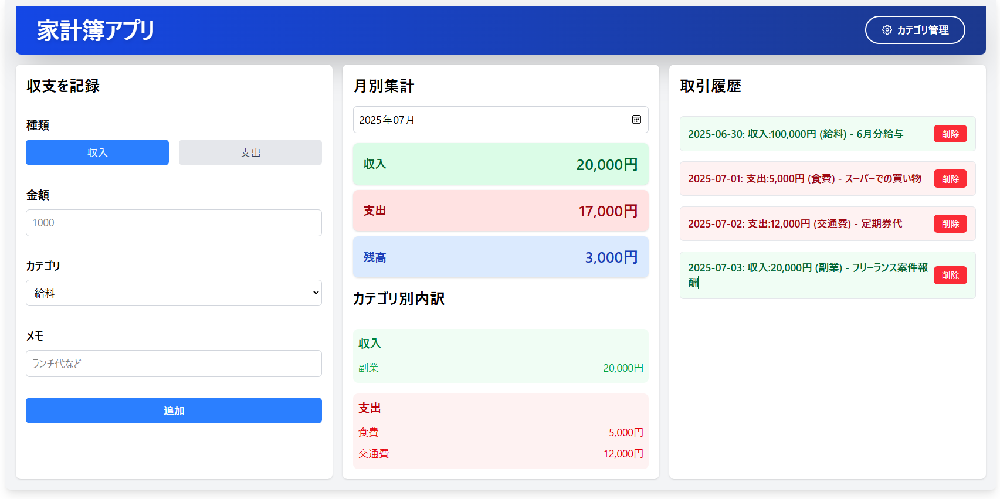
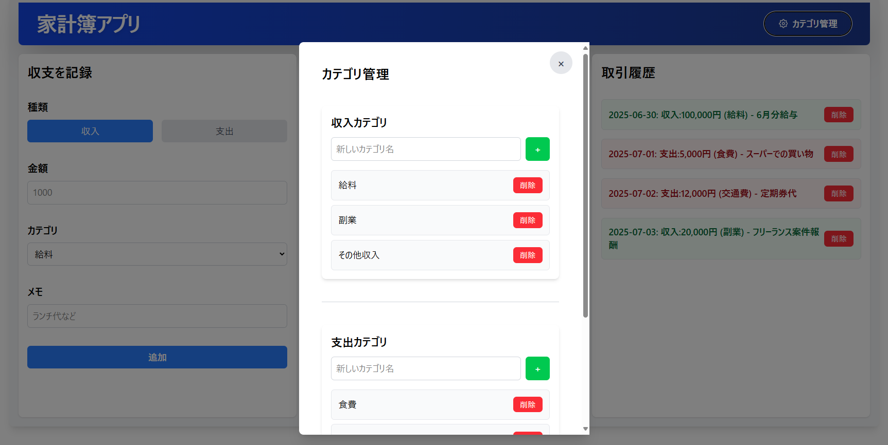

# simple-budget-app

# デモ
## 全体図

## カテゴリ管理

## 概要

このプロジェクトは、**React** と **Vite** を使用して構築したシンプルな家計簿アプリです。
ユーザーが収入と支出を記録し、月ごとの集計や取引履歴を確認できます。
特に、Reactの主要なフック（`useState`, `useContext`, `useReducer`, `useEffect`）の実践的な使い方を習得すること、
そして **Tailwind CSS** を用いたUIスタイリングを学ぶことを目的としています。

## 主な機能

### 1. 取引の記録
- **収入 / 支出** を選択
- **金額・カテゴリ・メモ** を入力
- 「追加」ボタンで保存
- 金額入力のバリデーション機能

### 2. 月別集計
- 当月の **収入・支出・残高** を自動計算
- 月を選んで表示を切り替え可能
- カテゴリ別の内訳も表示

### 3. 履歴表示
- 入力した取引を一覧表示（日付、種類、金額、カテゴリ、メモを含む）
- 個別に削除が可能（確認ダイアログ付き）
- 収入・支出に応じて色分け表示

### 4. カテゴリ管理
- 収入・支出のカテゴリを個別に追加・削除可能
- モーダルウィンドウで表示され、直感的に操作可能
- アプリケーション全体でカテゴリデータを共有

---

## Reactフックの活用

| フック名      | 使用例                                        |
|---------------|-----------------------------------------------|
| `useState`    | フォーム入力、設定情報（通貨・テーマ）などの状態管理 |
| `useReducer`  | 取引データ、カテゴリデータの追加・削除などの操作               |
| `useContext`  | 設定情報、取引データ、カテゴリデータをアプリ全体で共有                     |
| `useEffect`   | 月が変わったときに自動で集計を再計算、フォームのカテゴリ同期           |

## 使用技術

### フロントエンド

- [React](https://reactjs.org/)
- [Vite](https://vitejs.dev/)
- [Tailwind CSS](https://tailwindcss.com/)